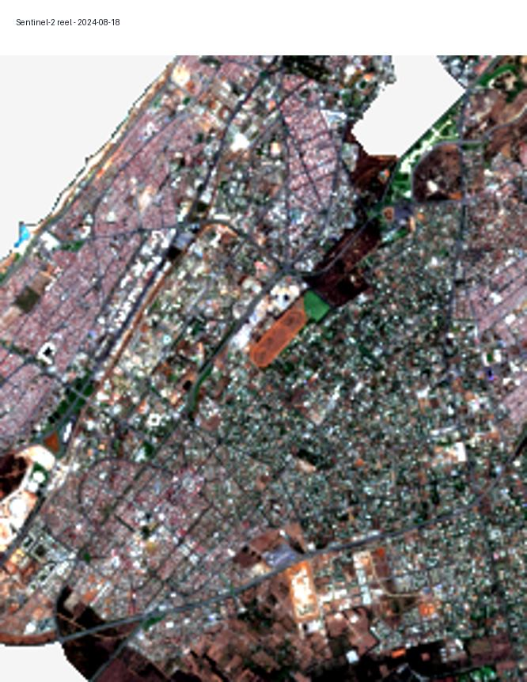
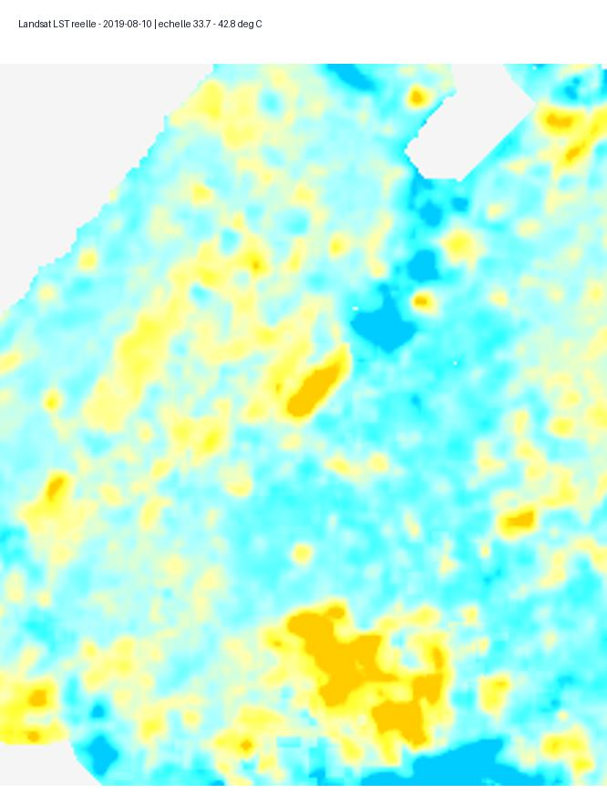
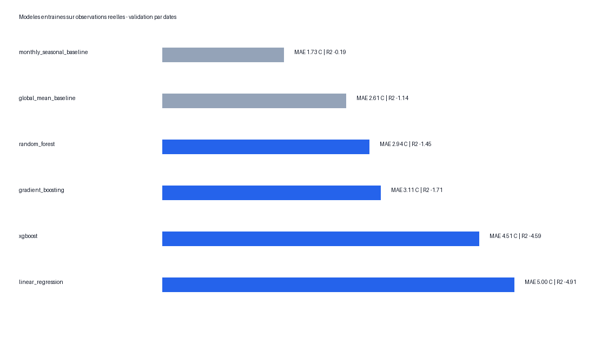
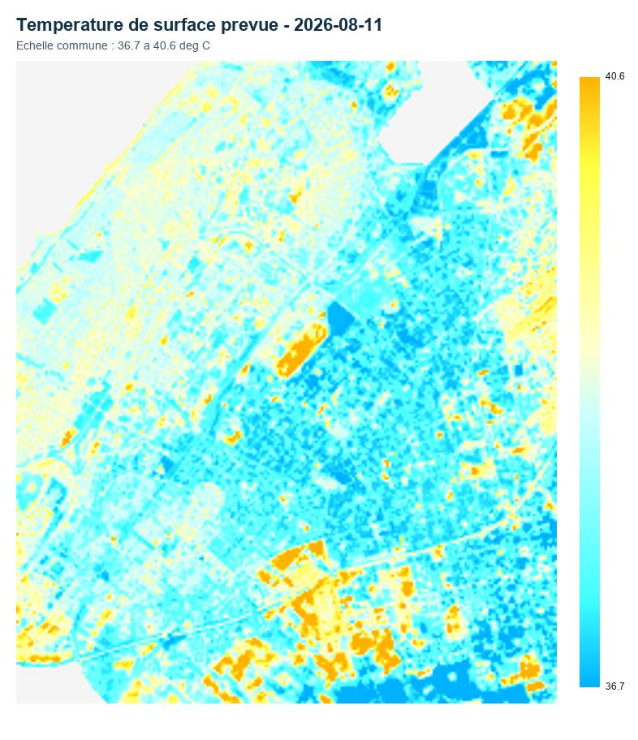
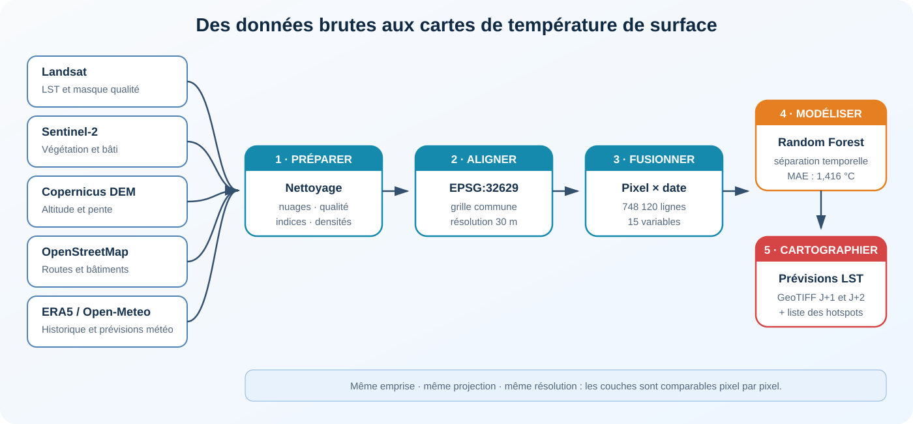
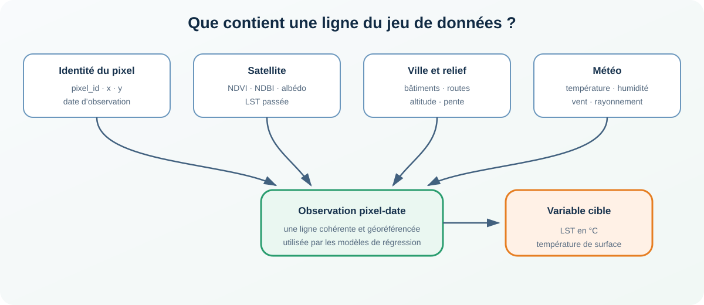

# GeoAI Rabat

Ce projet est parti d’une question simple : **peut-on utiliser les images satellites et la météo pour repérer les zones les plus chaudes de Rabat, puis estimer leur température de surface pour les deux jours suivants ?**

Le pipeline rassemble plusieurs sources géospatiales, les ramène sur une grille commune de 30 mètres, construit un jeu de données pixel-date et compare plusieurs modèles. Le résultat final est une paire de cartes GeoTIFF à J+1 et J+2.

> Ici, on prédit la **température de surface terrestre (LST)**. Ce n’est pas la température de l’air annoncée dans les applications météo.

## Aperçu du travail

<table>
  <tr>
    <td width="50%" align="center">
      
      <br /><sub>Composition Sentinel-2 de la zone pilote</sub>
    </td>
    <td width="50%" align="center">
      
      <br /><sub>LST réellement observée par Landsat</sub>
    </td>
  </tr>
  <tr>
    <td width="50%" align="center">
      
      <br /><sub>Comparaison des modèles pendant la validation</sub>
    </td>
    <td width="50%" align="center">
      
      <br /><sub>Exemple de carte prévisionnelle à J+1</sub>
    </td>
  </tr>
</table>

## Comment fonctionne le pipeline ?

<p align="center">
  
</p>

### Une ligne du jeu de données

Chaque ligne correspond à un pixel observé à une date donnée. Les colonnes décrivent son environnement et les conditions météorologiques de cette date.

<p align="center">
  
</p>

## Données mobilisées

| Source | Utilisation dans le projet |
|---|---|
| Landsat Collection 2 Level-2 | LST cible et masque qualité `QA_PIXEL` |
| Sentinel-2 | Indices de végétation et de bâti |
| Copernicus DEM | Altitude et pente |
| OpenStreetMap | Densité des bâtiments et des routes |
| ERA5-Land | Historique météorologique aux dates Landsat |
| Open-Meteo | Variables météorologiques pour J+1 et J+2 |

Toutes les couches sont reprojetées en `EPSG:32629` et alignées sur la même emprise avant leur fusion.

## Résultats du pilote

| Indicateur | Valeur |
|---|---:|
| Observations pixel-date | 748 120 |
| Pixels uniques | 53 690 |
| Dates Landsat | 14 |
| Variables explicatives | 15 |
| Observations du test final | 106 819 |
| MAE du Random Forest | 1,416 °C |
| RMSE du Random Forest | 1,831 °C |
| R² du Random Forest | 0,237 |

La séparation du jeu de données est **temporelle** : les deux dates de test restent inconnues jusqu’à l’évaluation finale. Sur ce test, la Random Forest atteint une MAE de 1,416 °C, contre 1,497 °C pour la baseline saisonnière.

Le résultat est encourageant pour une étude pilote, mais le R² et le biais montrent qu’il faut davantage de dates et une zone d’étude plus large avant d’envisager un usage opérationnel.

## Structure du dépôt

```text
configs/                 paramètres de la zone et des traitements
src/geoai_rabat/         code de collecte, préparation et modélisation
tests/                   tests unitaires et tests de livraison complète
data/raw/samples/        petits échantillons conservés dans Git
data/processed/          dictionnaire et extrait CSV de démonstration
artifacts/               métriques, splits et fiches des modèles
docs/                    choix méthodologiques et bilan des étapes
scripts/                 commandes PowerShell pour lancer le pipeline
```

Les images satellites brutes, les rasters intermédiaires, les tables Parquet et les modèles sérialisés ne sont pas stockés dans Git. Ils sont lourds et peuvent être reconstruits avec le pipeline.

## Installation

Le projet fonctionne avec Python 3.10 ou une version plus récente.

```powershell
git clone https://github.com/jawad-elkharrati/geoai-rabat-thermal-forecasting.git
cd geoai-rabat-thermal-forecasting

python -m venv .venv
.\.venv\Scripts\Activate.ps1
python -m pip install --upgrade pip
python -m pip install -r requirements-real.txt
```

## Lancer le projet

Sous Windows, le script suivant enchaîne la préparation, l’entraînement, l’évaluation, les prévisions et les contrôles :

```powershell
.\scripts\run_complete.ps1
```

Pour lancer seulement les tests légers :

```powershell
python -m pytest -m "not integration"
```

Une fois les données et les modèles générés, les contrôles complets deviennent disponibles :

```powershell
python -m geoai_rabat.cli verify-real --config configs/rabat_real_pilot.json
python -m geoai_rabat.cli verify-final --config configs/rabat_real_pilot.json
python -m geoai_rabat.cli verify-delivery --config configs/rabat_real_pilot.json
python -m pytest -m integration
```

La première exécution réelle télécharge plusieurs sources externes. Sa durée dépend donc de la connexion et de la machine.

## Où regarder dans le projet ?

- [Cadrage et question de recherche](docs/01_cadrage.md)
- [Inventaire des sources](docs/02_sources.md)
- [Méthode de modélisation](docs/05_modelisation.md)
- [Validation finale](docs/07_validation_finale.md)
- [Prévisions J+1 et J+2](docs/08_previsions_j1_j2.md)
- [Fiche du modèle final](artifacts/final/MODEL_CARD_FINAL.md)
- [Métriques du test final](artifacts/final/test_metrics_final.json)

## Limites connues

- La zone étudiée est une zone pilote et non toute la commune de Rabat.
- Le nombre de dates Landsat reste limité par la couverture nuageuse et la fréquence de passage.
- Les variables Sentinel-2 et urbaines sont considérées comme statiques dans cette version.
- La météo prévisionnelle est extraite au point central de la zone.
- Les cartes sont un outil d’analyse géospatiale, pas un dispositif officiel d’alerte sanitaire.
